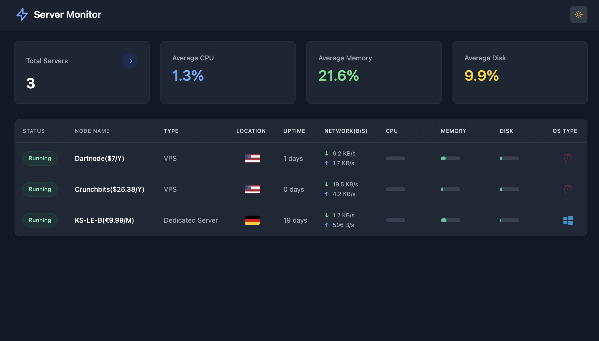

# Distributed Server Monitor

[](https://opensource.org/licenses/MIT)
[](https://go.dev/)
[](https://nextjs.org/)

A real-time monitoring dashboard for distributed servers — live CPU, memory,
disk, network, uptime, OS, location, **and Tailscale identity (IP + hostname)**
for every machine on your network.



The backend and monitoring agent are written in **Go** (single static binaries,
no runtime dependencies); the dashboard is **Next.js**. Built to run over a
**Tailscale** tailnet so nothing is exposed to the public internet.

```
            agents (Go static binary, one per server)
   web-1 ───┐
   db-1  ───┤  POST /api/servers/update  (every 2s)
   hub   ───┘            │
                         ▼
              ┌─────────────────────────┐     WebSocket push
              │   monitor-server (Go)   │ ────────────────────►  Dashboard
              │  REST + WebSocket + DB  │     (Next.js, real-time)
              └─────────────────────────┘
                 runs on the tailnet hub
                  http://<tailscale-ip>:5000
```

## Features

- Real-time metrics over WebSocket (polling fallback): CPU, memory, disk,
  network in/out, uptime
- **Tailscale IP + hostname** shown per server (expand a row for details)
- System info: OS/distribution, CPU model, total memory/disk, VPS vs dedicated
- Auto location detection and country flag
- Multi-server management with an allow-list and a secure admin panel
- IP-address protection: public IPs masked for unauthenticated viewers
- Automatic status detection (running → stopped after 30s of silence)
- Single static-binary agents for Linux (amd64/arm64), Windows, and macOS
- Self-install: agents download their binary from the hub itself

## Repository layout

```
.
├── frontend/           # Next.js App Router dashboard (Tailwind + shadcn, TanStack Query)
└── server-monitor-go/  # Go backend + agent  ← see its README for full docs
    ├── cmd/{server,agent}
    ├── internal/{config,domain,storage/sqlite,service/*,transport/*,masking,auth,metrics}
    ├── deploy/          # systemd units for the hub
    ├── scripts/         # build.sh, install_agent.sh, install_agent.ps1
    └── dist/            # built static binaries
```

Architecture and contributor docs:
[`docs/architecture.md`](docs/architecture.md) (backend layering + frontend
conventions) · [`docs/adding-a-feature.md`](docs/adding-a-feature.md)
(step-by-step checklist) · [`docs/PRD.md`](docs/PRD.md) (product requirements).

## Quick start

```bash
# 1. Backend — API + WebSocket + agent downloads on :5000
cd server-monitor-go
go run ./cmd/server

# 2. Frontend — dashboard on :3000
cd ../frontend
npm install && npm run build && npm start

# 3. Register a client, then run an agent for this machine
curl -X POST http://localhost:5000/api/clients \
     -H 'Content-Type: application/json' -d '{"name":"local"}'
cd ../server-monitor-go && go run ./cmd/agent --name local --server http://localhost:5000
```

Open the dashboard → **Total Servers → Admin**, set the admin password on first
visit, and watch `local` go from *Pending* → *Running* with live metrics.

## Deploying across your Tailscale network

The full, step-by-step procedure (hub setup, per-server agent install for
Linux/Windows/macOS, systemd units, configuration, and the complete API
reference) lives in:

### → [`server-monitor-go/README.md`](server-monitor-go/README.md)

Short version, per server:

1. Dashboard → **Admin → Add Client** → register a name (e.g. `web-1`).
2. On that server (on the tailnet): `sudo bash install_agent.sh web-1 http://<hub-tailscale-ip>:5000`
3. It appears Running within ~2s, showing its Tailscale IP and hostname.

Step-by-step walkthrough for onboarding a machine from a fresh `git clone`
(including Windows and build-from-source): **[docs/add-machine.md](docs/add-machine.md)**

## License

MIT — see [LICENSE](LICENSE).
